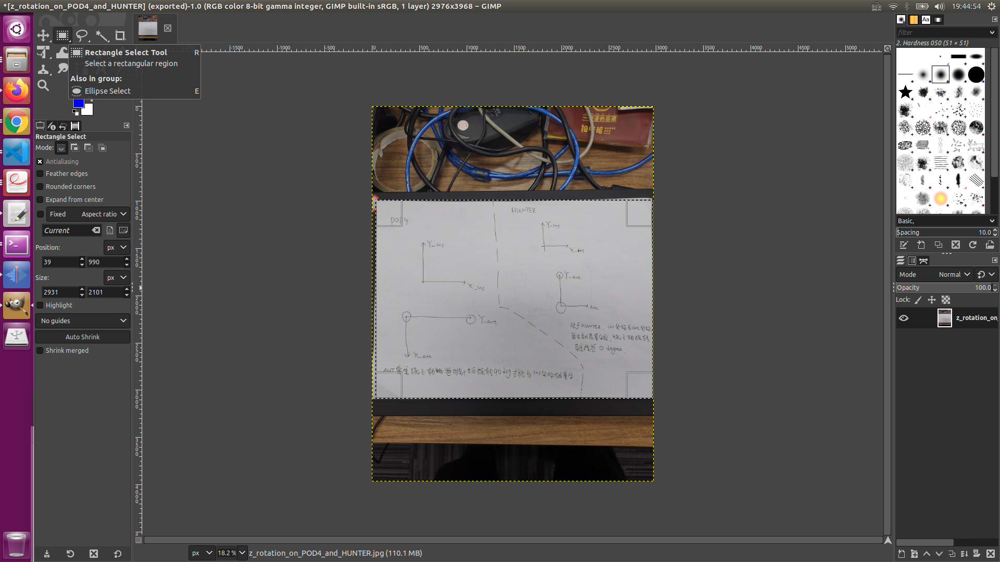
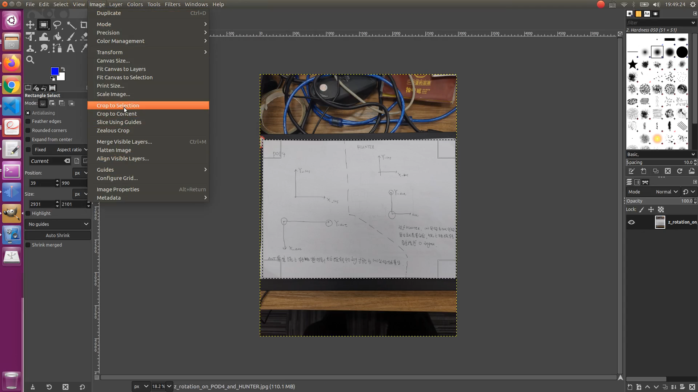
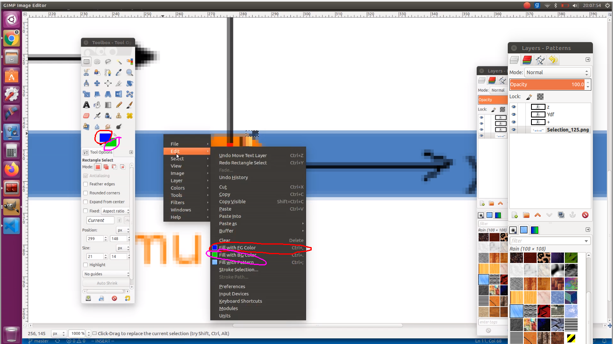

# GIMP_Usage

## Q & A

### 1. 如何进行图片的裁剪

Step1: 使用"Rectangle Select Tool"来选取要保留的区域

Step2: 使用"Image" -> "Crop to Selection"进行裁剪

### 2. 如何对选中的区域填充任意颜色？

其实，Foreground color（前景色）和 background color（背景色）是可以自己选的，并不是固定为黑色/白色的

第一个问题，当用"Rectangle Select Tool"选中了一个矩形区域后，该如何取消这个被选择区域的光标？

